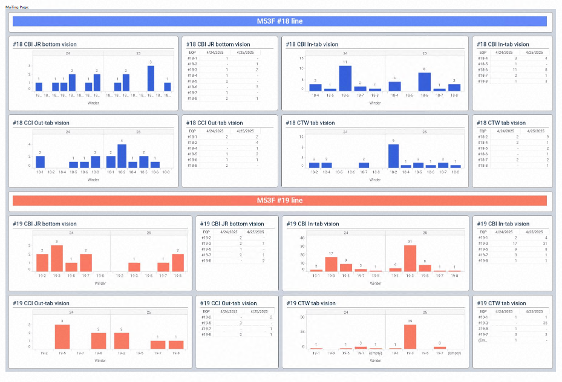

#  CEF Infusion Defect Traceability & Root Cause Dashboard

This project showcases a SQL-driven analytical pipeline designed to diagnose and visualize **infusion defects** in the ** Electrolyte Filling (EF)** process within battery manufacturing.  
> *Disclaimer: All data and dashboards are based on **sample data** only, due to the confidentiality.*

---

## Business Context

In the battery assembly process, the **EF stage** is critical for ensuring cell performance and reliability. Two primary defect types are monitored:

- **Infusion Defect** (`dfct_cd = 5`): Electrolyte fails to impregnate to the cells, due to misalignment in anode and cathode.
- **Filling Defect** (`dfct_cd = 4`): Incomplete filling or over filling the amount of electrolytes.
- **OK Cell** (`dfct_cd = 0`)

**Infusion defects** have been often originating from the upstream **Winder process**. Early detection and equipment-level traceability are essential to minimize defect rates in the process.

---

## Project Objectives

- Develop a real-time detection system for infusion defects  
- Trace defects back to specific **Winder equipment**  
- Monitor **Critical-to-Quality (CTQ)** parameters, especially the separator–anode gap  
- Provide interactive dashboards to support operations and quality assurance teams  

---

##  Analytical Approach

Using engineering insights and historical data:

- The **separator–anode gap** is a key CTQ parameter that affects electrolyte flow
- Gap values are recorded in the `isp_ifo_h` inspection table, by equipment
- By linking defects to prior Winder machines, root causes can be exposed

### Analytical Steps:
1. Trace defect records back to upstream equipment using `lot_id`
2. Merge CTQ inspection values with defect records
3. Identify statistical anomalies (mean/variance of gaps)
4. Visualize trend deviations by equipment over time

---

##  Data Sources (provided data is sample data due to confidentiality)

| Table | Description | Key Fields |
|-------|-------------|------------|
| `cef_defects` | CEF defect logs | `lot_id`, `dfct_cd`, `proc_dt` |
| `isp_ifo_h` | Winder inspection records | `eqp_id`, `gap_val`, `insp_dt` |
| `eqp_trace` | Equipment routing log | `lot_id`, `eqp_id`, `proc_dt` |

---

## Data Preparation
📁 SQL File: [`CEF_Infusion_to_WND.sql`](SQL/CEF_Infusion_to_WND.sql)
- **Filtered Assembly (CEF) data** for `proc_nm = 'Assembly'`, CEF equipment, and recent production dates (±2 days), excluding known infusion defects (`dfct_cd = '5'`)
- **Joined with Winding process data** using `jero_id` within a ±3 day window to trace back equipment history
- **Standardized equipment labels** using `CASE` and `SUBSTRING` logic for traceability (e.g., `#18 (NJ6 ASB)`)
- **Mapped CTQ values** (separator–anode gap) via subqueries from inspection table `isp_ifo_h`
- Final dataset filtered to target lines (`#18`, `#19`) and sorted by plant, equipment, and time

---

## KPIs Tracked

| Metric | Formula | Purpose |
|--------|---------|---------|
| Infusion Defect Rate | `count(dfct_cd=5) / count(*)` | Track critical defect trends |
| Avg. Gap per EQP | `AVG(gap_val)` | Identify misaligned machines |
| Gap Std Dev | `STDDEV(gap_val)` | Detect unstable equipment |

---

## Key Findings & Insights

- **Winder #3 and #7** showed **abnormally high infusion defect rates**  
- These machines also exhibited **low average separator–anode gaps** with **higher variance**, indicating CTQ instability  
- Implementing dashboard alerts enabled:
  - Faster root cause identification
  - Preventive maintenance based on real-time CTQ drift
  - Yield improvement through targeted interventions

---

## Dashboard Visuals

**Primary Infusion Defect Monitoring Dashboard**  

**Other CTQ and Defect Insights**  

---

## Business Impact

- Reduced defect trace time from **2–3 days to under  30 minutes**  
- Identified yield loss root causes before secondary processes  
- Projected to improve line yield by **~50%** through early CTQ drift alerts  
- Scalable to other process-critical defects (e.g., tab alignment defects and etc)

---

## Future Improvements

- Send Real time email to process operator when anomalies in CTQ from dashboards are identified.  
- Use statistical process control (SPC) rules and detect anomalies in CTQ real time

---

## Author & Project Role

This project was developed by a **battery process engineer**, bridging domain knowledge with **data analytics and real-time visualization**. It exemplifies how SQL and Tableau can be used to support decision-making in high-throughput manufacturing environments.

